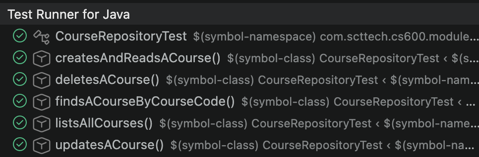
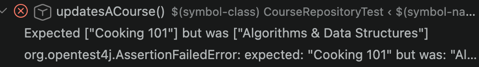
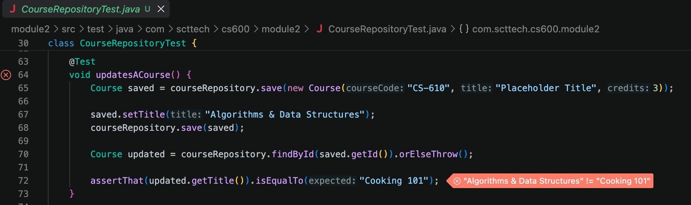

# Module 2: Introduction to Spring Data JPA

This module introduces [Spring Data JPA](https://spring.io/projects/spring-data-jpa) by modeling the
first table of a course catalog: a single `Course` entity backed by a Postgres database running in
Docker. Later modules build on this same catalog extending the functionality.

## What you'll learn

- Mapping a Java class to a database table with `@Entity`
- Defining a repository interface with Spring Data JPA (`JpaRepository`) to get CRUD operations for free
- Deriving a custom query method (`findByCourseCode`) from its method name
- Testing a repository against a real Postgres database using [Testcontainers](https://testcontainers.com/)

## Project layout

| File | Purpose |
| --- | --- |
| [`Course.java`](../../../module2/src/main/java/com/scttech/cs600/module2/model/Course.java) | The JPA entity mapped to the `courses` table |
| [`CourseRepository.java`](../../../module2/src/main/java/com/scttech/cs600/module2/repository/CourseRepository.java) | Spring Data JPA repository for `Course` |
| [`CourseRepositoryTest.java`](../../../module2/src/test/java/com/scttech/cs600/module2/CourseRepositoryTest.java) | CRUD tests run against a throwaway Postgres container |
| [`docker-compose.yml`](../../../module2/docker-compose.yml) | Starts a local Postgres instance for running the app |
| [`application.properties`](../../../module2/src/main/resources/application.properties) | Datasource and JPA configuration |

## Running it locally

### 1. Start Postgres

```bash
cd module2
docker compose up -d
```

This starts a Postgres 16 container (database `module2db`, user/password `postgres`) on
`localhost:5432`.

### 2. Run the application

```bash
../mvnw spring-boot:run
```

(Run from inside `module2/`, as above — `../mvnw` is the wrapper shared by the whole repo.)

On startup, Hibernate creates the `courses` table automatically (`spring.jpa.hibernate.ddl-auto=update`).
This is convenient while we're iterating in class, but isn't how you'd manage schema changes against a
real production database — see the comment in `application.properties`.

### 3. Run the tests

```bash
../mvnw test -Dtest=CourseRepositoryTest
```

These tests don't touch the Postgres container started in step 1 — they spin up their own disposable
Postgres container via Testcontainers, so they'll pass on a clean checkout with nothing but Docker
running. That's what lets `CourseRepositoryTest` double as a runnable, self-contained demonstration of
each CRUD operation.

Below is a screenshot of the successful tests



If we look at a test, we see that we updated a course title from `Placeholder Title` to `Algorithms & Data Structures` and then use `assertThat` to ensure it was updated.

```java
@Test
void updatesACourse() {
    Course saved = courseRepository.save(new Course("CS-610", "Placeholder Title", 3));

    saved.setTitle("Algorithms & Data Structures");
    courseRepository.save(saved);

    Course updated = courseRepository.findById(saved.getId()).orElseThrow();

    assertThat(updated.getTitle()).isEqualTo("Algorithms & Data Structures");
}
```

We can change that final line to test if the course name was updated to `Cooking 101`

```java
assertThat(updated.getTitle()).isEqualTo("Cooking 101");
```

After that change, when we re-run the tests we will see the failing test.



Depending on the IDE that you are using, you may also see the failing test in the code window.  We can see that on line 64, there is an icon off to the left showing the test failed.  Line 72 is also flagged with the error and the values causing the issue.

An example from Visual Studio Code is shown below:

