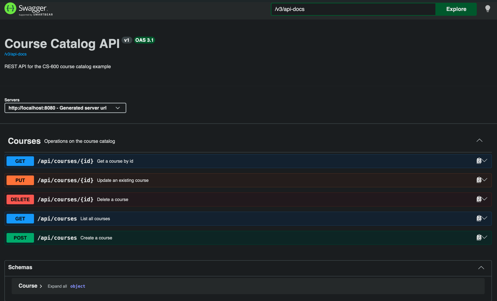

# Module 2: A RESTful API for the Course Catalog

This builds on [the JPA walkthrough](../jpa/README.md) by putting a REST API in front of the `Course`
entity and repository, with OpenAPI documentation generated automatically from the code via
[springdoc-openapi](https://springdoc.org/).

## What you'll learn

- Exposing CRUD operations over HTTP with `@RestController`
- Mapping repository results to standard REST status codes (`200`, `201`, `204`, `404`, `409`)
- Validating request bodies with Bean Validation (`@NotBlank`, `@Min`, `@Valid`)
- Generating an OpenAPI 3 spec and browsable Swagger UI straight from the controller — no hand-written
  YAML/JSON

## Project layout

| File | Purpose |
| --- | --- |
| [`CourseController.java`](../../../module2/src/main/java/com/scttech/cs600/module2/controller/CourseController.java) | REST endpoints for `Course` |
| [`OpenApiConfig.java`](../../../module2/src/main/java/com/scttech/cs600/module2/config/OpenApiConfig.java) | Sets the title/description/version shown in the generated docs |
| [`Course.java`](../../../module2/src/main/java/com/scttech/cs600/module2/model/Course.java) | Same entity from the JPA module, now with validation annotations |
| [`CourseControllerTest.java`](../../../module2/src/test/java/com/scttech/cs600/module2/CourseControllerTest.java) | `@WebMvcTest` unit tests for every endpoint, with the repository mocked out |

## Running it locally

Start Postgres and the app the same way as the [JPA module](../jpa/README.md#running-it-locally):

```bash
cd module2
docker compose up -d
../mvnw spring-boot:run
```

## The API

| Method | Path | Description |
| --- | --- | --- |
| `GET` | `/api/courses` | List all courses |
| `GET` | `/api/courses/{id}` | Get a course by id (`404` if missing) |
| `POST` | `/api/courses` | Create a course (`201` with a `Location` header; `409` on a duplicate `courseCode`) |
| `PUT` | `/api/courses/{id}` | Replace an existing course (`404` if missing) |
| `DELETE` | `/api/courses/{id}` | Delete a course (`204`; `404` if missing) |

A course looks like this:

```json
{
  "courseCode": "CS-600",
  "title": "Software Design and Development",
  "credits": 3
}
```

`courseCode` and `title` are required, and `credits` must be at least `1` — posting anything else
returns a `400`.

Try it once the app is running:

```bash
curl -X POST http://localhost:8080/api/courses \
  -H "Content-Type: application/json" \
  -d '{"courseCode":"CS-600","title":"Software Design and Development","credits":3}'

curl http://localhost:8080/api/courses
```

## Testing the controller

```bash
cd module2
../mvnw test -Dtest=CourseControllerTest
```

Unlike `CourseRepositoryTest`, this doesn't touch a database at all. `@WebMvcTest` loads just the web
layer and hands `CourseController` a mocked `CourseRepository`, so each test can dictate exactly what
the "database" returns and assert on the resulting HTTP status, headers, and JSON body — including the
`404`, `409`, and `400` cases that are otherwise easy to forget to check by hand.

## Mutation testing with PIT

```bash
cd module2
../mvnw test-compile org.pitest:pitest-maven:mutationCoverage
```

Line/branch coverage only tells you whether a line *ran* during the tests, not whether the tests would
actually notice if that line were wrong. [PIT](https://pitest.org/) (pitest) checks that by rewriting
the compiled bytecode with small deliberate bugs — "mutants" — one at a time (dropping a method call,
flipping a condition, returning `null` instead of the real value, ...) and rerunning the tests against
each one. A mutant that makes a test fail is **killed**; a mutant the tests don't notice **survives**,
which means there's a gap in the test suite even though coverage looked complete.

PIT is scoped to `com.scttech.cs600.module2.controller` and `CourseControllerTest`, configured in
[module2's own `pom.xml`](../../../module2/pom.xml). That's deliberate: `CourseRepositoryTest` starts a
Testcontainers Postgres instance, and PIT reruns the target tests once per mutant (dozens of times per
class) — fine for a fast `@WebMvcTest` slice, impractically slow against a container that has to start
each time.

The report lands at `module2/target/pit-reports/index.html`. The first run here actually caught
something real: PIT deleted the `existing.setCourseCode(update.getCourseCode())` call in
`CourseController.update()` and `updatesAnExistingCourse` still passed, because that test's update body
reused the same course code the existing course already had — so nothing observable changed whether the
line ran or not. Line coverage was 100% the whole time; it just couldn't tell the difference. Changing
the test to update to a *different* course code (and asserting on it) closed the gap, and the suite now
kills every mutant it generates.

## OpenAPI documentation



With the app running:

- **Swagger UI** (interactive, try-it-out docs): <http://localhost:8080/swagger-ui/index.html>
- **Raw OpenAPI spec** (JSON): <http://localhost:8080/v3/api-docs>

Both are generated automatically from `CourseController` and the validation annotations on `Course` —
add an endpoint or a constraint and the docs update the next time the app starts, with nothing to keep
in sync by hand.
