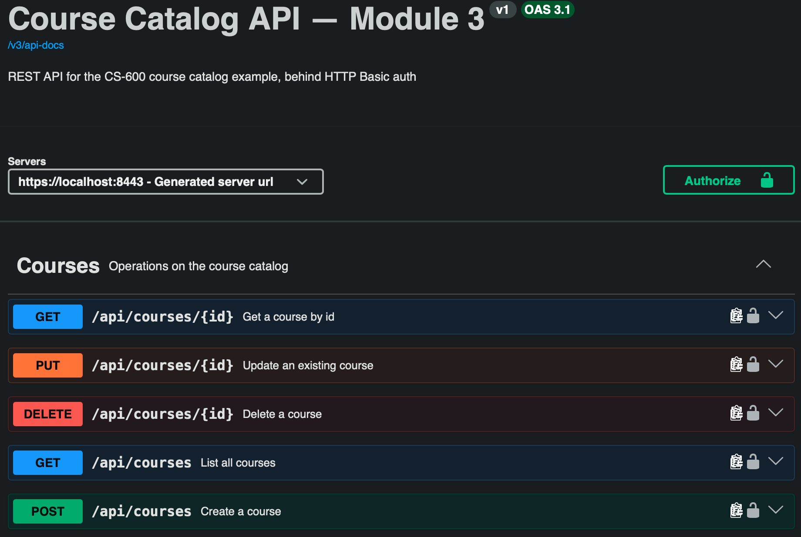
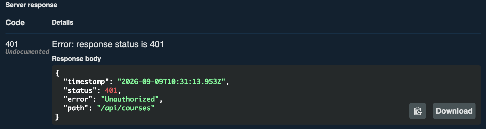
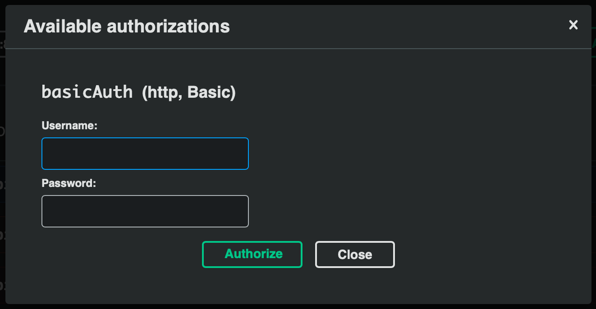
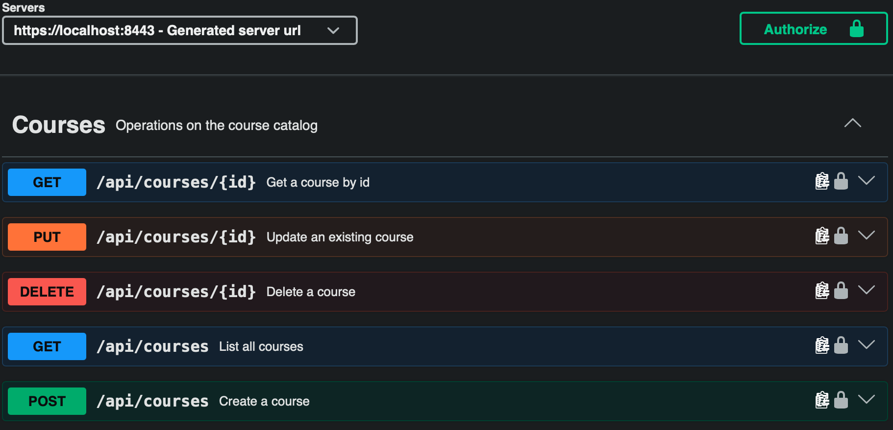
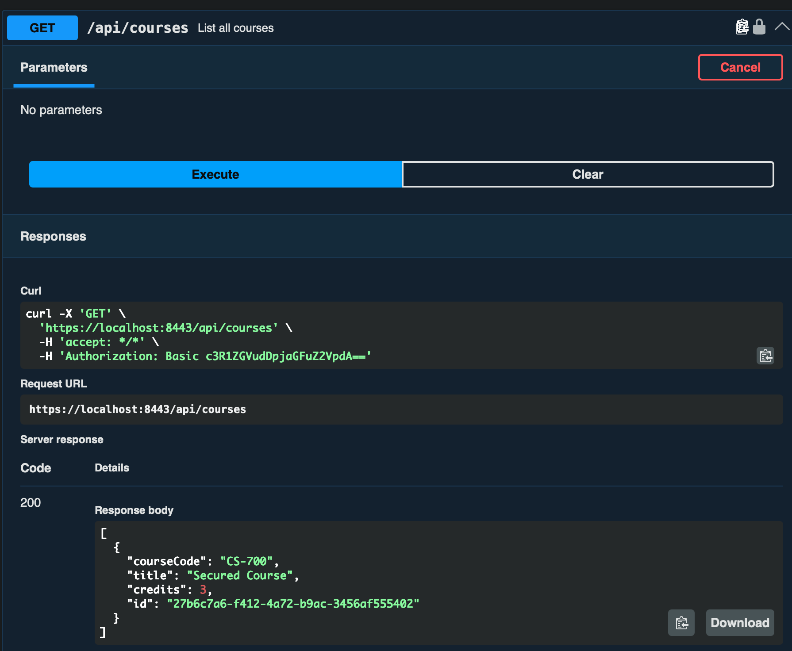

# Module 3: RESTful API 

Module 3's REST layer: the same endpoints as
[module 2's REST API](../../module2/rest/README.md). What's new
here, covered below, is [Spring Security](https://spring.io/projects/spring-security): TLS for the app,
and HTTP Basic auth in front of every `/api/courses/**` endpoint.

## Project layout

| File | Purpose |
| --- | --- |
| [`CourseController.java`](../../../module3/src/main/java/com/scttech/cs600/module3/controller/CourseController.java) | REST endpoints for `Course`, mapped to `/api/courses` |
| [`Course.java`](../../../module3/src/main/java/com/scttech/cs600/module3/model/Course.java) | Same entity as the JPA module |
| [`CourseControllerTest.java`](../../../module3/src/test/java/com/scttech/cs600/module3/CourseControllerTest.java) | `@WebMvcTest` unit tests for every endpoint, including auth |
| [`OpenApiConfig.java`](../../../module3/src/main/java/com/scttech/cs600/module3/config/OpenApiConfig.java) | Titles the generated docs and declares the `basicAuth` scheme Swagger UI's Authorize button uses |

## The API

| Method | Path | Description |
| --- | --- | --- |
| `GET` | `/api/courses` | List all courses |
| `GET` | `/api/courses/{id}` | Get a course by id (`404` if missing) |
| `POST` | `/api/courses` | Create a course (`201` with a `Location` header; `409` on a duplicate `courseCode`) |
| `PUT` | `/api/courses/{id}` | Replace an existing course (`404` if missing) |
| `DELETE` | `/api/courses/{id}` | Delete a course (`204`; `404` if missing) |

Validation, status codes, the id-security fix, and mutation testing all still work exactly like
[module 2](../../module2/rest/README.md). Every one of the endpoints above now requires HTTP Basic auth.

```bash
cd module3
../mvnw test -Dtest=CourseControllerTest
```

## TLS and Basic Auth

| File | Purpose |
| --- | --- |
| [`SecurityConfig.java`](../../../module3/src/main/java/com/scttech/cs600/module3/config/SecurityConfig.java) | Requires HTTP Basic auth for `/api/courses/**`; leaves Swagger UI/actuator open |
| [`keystore.p12`](../../../module3/src/main/resources/keystore.p12) | Self-signed dev certificate used for TLS |

**TLS** is terminated by the embedded Tomcat connector itself — a connector is either serving HTTPS or
it isn't, for every request on that port, regardless of which controller handles it. So
`server.ssl.enabled=true` (see [application.properties](../../../module3/src/main/resources/application.properties)) moves module 3's *whole app* to
`https://localhost:8443`. That's fine now that module 3 is its own application — there's no other
module's endpoints in this app for it to drag along.

**Authentication** is enforced by a Spring Security filter chain, scoped to the API paths only:

```java
@Bean
SecurityFilterChain securityFilterChain(HttpSecurity http) {
    http.authorizeHttpRequests(auth -> auth
            .requestMatchers("/api/courses/**").authenticated()
            .anyRequest().permitAll())
        .httpBasic(Customizer.withDefaults());
    ...
}
```

Anything under `/api/courses/**` needs a valid `Authorization: Basic ...` header; everything else —
Swagger UI, `/v3/api-docs`, `/actuator/**` — stays open, so the docs remain browsable without logging in.

**Why the self-signed certificate is committed to the repo.** `keystore.p12` is a throwaway, dev-only
certificate for `localhost`, generated once with:

```bash
keytool -genkeypair -alias cs600 -keyalg RSA -keysize 2048 -storetype PKCS12 \
  -keystore keystore.p12 -validity 3650 -storepass changeit \
  -dname "CN=localhost, OU=CS600, O=SNHU, L=Manchester, ST=NH, C=US"
```

It's not signed by a trusted CA, so browsers and `curl` will warn about it (`curl -k` skips the check;
a browser needs a manual "proceed anyway" click). That's expected for local dev and is exactly why a
real deployment would use a certificate from a real CA instead — this is here to demonstrate configuring
TLS on the server, not to model certificate issuance.

**Credentials.** The one in-memory user (`app.security.username` / `app.security.password` in
`application.properties`, defaulting to `student` / `changeit`) is dev-only, in the same spirit as the
Postgres credentials already in that file — not something you'd hardcode in a real app.

Try it once the app is running:

```bash
# 401 without credentials
curl -k -i https://localhost:8443/api/courses

# works with the right ones
curl -k -u student:changeit https://localhost:8443/api/courses
```

## OpenAPI documentation

With the app running:

- **Swagger UI**: <https://localhost:8443/swagger-ui/index.html>
- **Raw OpenAPI spec** (JSON): <https://localhost:8443/v3/api-docs>

Every operation is marked with a lock icon (notice that the icon is unlocked because we are not authorized yet) and requires using Swagger UI's **Authorize** button
(`student` / `changeit`) before "Try it out" will work. One thing worth knowing: once you authorize (or
answer a browser-native Basic Auth prompt) once, the browser will keep attaching those credentials to
*every* subsequent request to `https://localhost:8443` for the rest of that browser session — that's
normal browser behavior for HTTP Basic, not something this app is doing, and it's easy to mistake for
auth "not being enforced" if you're not expecting it.



If we were to make a request with the "Try now" and we did not provide correct credentials, we would receive a 401 error, as shown below:



We can click the green authorize button to bring up a prompt to authorize the request.



Once authorized, the lock icons will all appear locked.



Then, we can make requests as needed.


