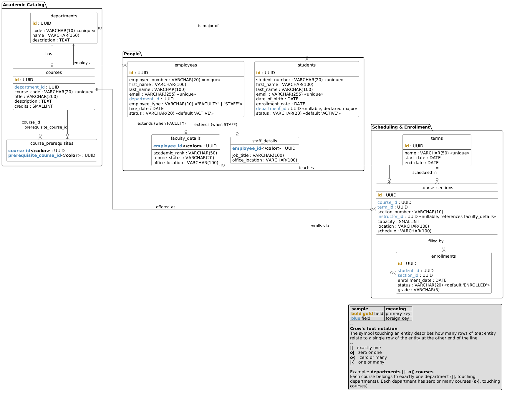

# Overview

Module 4 expands the database design to build out more of a full-fledged system rather than
just course listings. [Module 3](../module3/README.md)'s `courses` table (see
[`Course.java`](../../module3/src/main/java/com/scttech/cs600/module3/model/Course.java)) becomes
one piece of a normalized registrar-style schema that also covers departments, students, and
faculty/staff.

## Changes in this module

This module intentionally doesn't have its own code. Instead, we focus on the database design
before we implement it, using [PlantUML](https://plantuml.com/ie-diagram) entity-relationship
diagrams as the design artifact.

- [`erd/database-design.puml`](./erd/database-design.puml) — the full ERD

To view it: the [PlantUML VS Code extension](https://marketplace.visualstudio.com/items?itemName=jebbs.plantuml),
the `plantuml` CLI, or pasting the file's contents into the
[online PlantUML editor](https://www.plantuml.com/plantuml/uml/) will all render it.

## Schema

## Design overview

The schema is organized into three groups of tables:

| Group | Tables |
| --- | --- |
| Academic catalog | `departments`, `courses`, `course_prerequisites` |
| People | `employees`, `faculty_details`, `staff_details`, `students` |
| Scheduling & enrollment | `terms`, `course_sections`, `enrollments` |

**Why scheduling and enrollment tables, when only departments/students/faculty/course catalog
were asked for?** A course catalog by itself can't represent "students take courses" or "faculty
teach courses" in a way that holds up to normalization — a course can be taught by different
instructors each term, and a student's enrollment has its own lifecycle (enrolled, dropped,
graded). `terms` and `course_sections` split "the abstract course" (`courses`, e.g. *CS-600*) from
"a specific offering of it" (`course_sections`, e.g. *CS-600, Section 001, Fall 2026, taught by
Dr. X*), and `enrollments` is the join table between `students` and `course_sections`. This is how
real registrar systems are normalized, and it avoids modeling a course as only ever having one
instructor or one roster, ever.

**Why `employees` + `faculty_details` / `staff_details` instead of two flat tables?** Faculty and
staff share most attributes (name, email, department, hire date, status) and diverge on only a
few (academic rank/tenure vs. job title). Splitting the shared columns into `employees` and the
type-specific columns into a 1:1 "detail" table (keyed by the same id) avoids duplicating the
shared columns and avoids nullable columns that only make sense for one subtype. It's the standard
"class-table inheritance" pattern, and it composes with `employee_type` doing double duty: it
tells you which detail table to expect a row in, and `course_sections.instructor_id` references
`faculty_details.employee_id` directly (not `employees.id`), so the database itself enforces that
only faculty can be assigned as an instructor.

## Conventions

These conventions apply to every table (they're omitted from the diagram itself for readability):

- **Primary keys**: `id UUID PRIMARY KEY DEFAULT gen_random_uuid()`, matching the existing
  `Course` entity's `GenerationType.UUID` strategy. `gen_random_uuid()` is built into Postgres 16
  (the version this project already runs via `docker-compose.yml`), so no extension is needed.
- **Audit columns**: every table except pure join tables (`course_prerequisites`) has
  `created_at TIMESTAMPTZ NOT NULL DEFAULT now()` and `updated_at TIMESTAMPTZ NOT NULL DEFAULT now()`.
- **Naming**: `snake_case` table and column names, matching the `@Column(name = "...")` convention
  already used in `Course.java`.
- **"Enum-like" columns** (`employee_type`, `status`, `academic_rank`, `tenure_status`) are plain
  `VARCHAR` with a `CHECK (... IN (...))` constraint rather than a native Postgres `ENUM` type —
  adding a value later is an `ALTER TABLE ... DROP/ADD CONSTRAINT`, not a schema-wide `ALTER TYPE`.

## Tables

### `departments`

| Column | Type | Constraints |
| --- | --- | --- |
| `id` | `UUID` | PK |
| `code` | `VARCHAR(10)` | `NOT NULL`, `UNIQUE` — e.g. `CS` |
| `name` | `VARCHAR(150)` | `NOT NULL` |
| `description` | `TEXT` | |

### `courses`

| Column | Type | Constraints |
| --- | --- | --- |
| `id` | `UUID` | PK |
| `department_id` | `UUID` | `NOT NULL`, FK → `departments.id` |
| `course_code` | `VARCHAR(20)` | `NOT NULL`, `UNIQUE` — e.g. `CS-600` |
| `title` | `VARCHAR(200)` | `NOT NULL` |
| `description` | `TEXT` | |
| `credits` | `SMALLINT` | `NOT NULL`, `CHECK (credits > 0)` |

### `course_prerequisites`

Self-referencing many-to-many join table on `courses`.

| Column | Type | Constraints |
| --- | --- | --- |
| `course_id` | `UUID` | PK (composite), FK → `courses.id` |
| `prerequisite_course_id` | `UUID` | PK (composite), FK → `courses.id` |

`CHECK (course_id <> prerequisite_course_id)` — a course can't be its own prerequisite.

### `employees`

Shared attributes for both faculty and staff.

| Column | Type | Constraints |
| --- | --- | --- |
| `id` | `UUID` | PK |
| `employee_number` | `VARCHAR(20)` | `NOT NULL`, `UNIQUE` |
| `first_name` | `VARCHAR(100)` | `NOT NULL` |
| `last_name` | `VARCHAR(100)` | `NOT NULL` |
| `email` | `VARCHAR(255)` | `NOT NULL`, `UNIQUE` |
| `department_id` | `UUID` | `NOT NULL`, FK → `departments.id` |
| `employee_type` | `VARCHAR(10)` | `NOT NULL`, `CHECK (employee_type IN ('FACULTY', 'STAFF'))` |
| `hire_date` | `DATE` | `NOT NULL` |
| `status` | `VARCHAR(20)` | `NOT NULL DEFAULT 'ACTIVE'`, `CHECK (status IN ('ACTIVE', 'INACTIVE', 'TERMINATED'))` |

### `faculty_details`

One row per `employees` row where `employee_type = 'FACULTY'`.

| Column | Type | Constraints |
| --- | --- | --- |
| `employee_id` | `UUID` | PK, FK → `employees.id` |
| `academic_rank` | `VARCHAR(50)` | `NOT NULL`, `CHECK (... IN ('INSTRUCTOR', 'ASSISTANT_PROFESSOR', 'ASSOCIATE_PROFESSOR', 'PROFESSOR', 'ADJUNCT'))` |
| `tenure_status` | `VARCHAR(20)` | `CHECK (... IN ('TENURED', 'TENURE_TRACK', 'NON_TENURE'))` |
| `office_location` | `VARCHAR(100)` | |

### `staff_details`

One row per `employees` row where `employee_type = 'STAFF'`.

| Column | Type | Constraints |
| --- | --- | --- |
| `employee_id` | `UUID` | PK, FK → `employees.id` |
| `job_title` | `VARCHAR(100)` | `NOT NULL` |
| `office_location` | `VARCHAR(100)` | |

### `students`

| Column | Type | Constraints |
| --- | --- | --- |
| `id` | `UUID` | PK |
| `student_number` | `VARCHAR(20)` | `NOT NULL`, `UNIQUE` |
| `first_name` | `VARCHAR(100)` | `NOT NULL` |
| `last_name` | `VARCHAR(100)` | `NOT NULL` |
| `email` | `VARCHAR(255)` | `NOT NULL`, `UNIQUE` |
| `date_of_birth` | `DATE` | |
| `enrollment_date` | `DATE` | `NOT NULL` |
| `department_id` | `UUID` | FK → `departments.id`, nullable (undeclared major) |
| `status` | `VARCHAR(20)` | `NOT NULL DEFAULT 'ACTIVE'`, `CHECK (status IN ('ACTIVE', 'INACTIVE', 'GRADUATED', 'WITHDRAWN'))` |

### `terms`

| Column | Type | Constraints |
| --- | --- | --- |
| `id` | `UUID` | PK |
| `name` | `VARCHAR(50)` | `NOT NULL`, `UNIQUE` — e.g. `Fall 2026` |
| `start_date` | `DATE` | `NOT NULL` |
| `end_date` | `DATE` | `NOT NULL`, `CHECK (end_date > start_date)` |

### `course_sections`

A specific offering of a `course` within a `term`.

| Column | Type | Constraints |
| --- | --- | --- |
| `id` | `UUID` | PK |
| `course_id` | `UUID` | `NOT NULL`, FK → `courses.id` |
| `term_id` | `UUID` | `NOT NULL`, FK → `terms.id` |
| `section_number` | `VARCHAR(10)` | `NOT NULL` — e.g. `001` |
| `instructor_id` | `UUID` | FK → `faculty_details.employee_id`, nullable (TBD instructor) |
| `capacity` | `SMALLINT` | `NOT NULL`, `CHECK (capacity > 0)` |
| `location` | `VARCHAR(100)` | |
| `schedule` | `VARCHAR(100)` | e.g. `MWF 10:00-10:50` |

`UNIQUE (course_id, term_id, section_number)`.

### `enrollments`

Join table between `students` and `course_sections`.

| Column | Type | Constraints |
| --- | --- | --- |
| `id` | `UUID` | PK |
| `student_id` | `UUID` | `NOT NULL`, FK → `students.id` |
| `section_id` | `UUID` | `NOT NULL`, FK → `course_sections.id` |
| `enrollment_date` | `DATE` | `NOT NULL DEFAULT CURRENT_DATE` |
| `status` | `VARCHAR(20)` | `NOT NULL DEFAULT 'ENROLLED'`, `CHECK (... IN ('ENROLLED', 'DROPPED', 'COMPLETED', 'WITHDRAWN'))` |
| `grade` | `VARCHAR(5)` | nullable until the section completes |

`UNIQUE (student_id, section_id)` — a student enrolls in a given section at most once.
