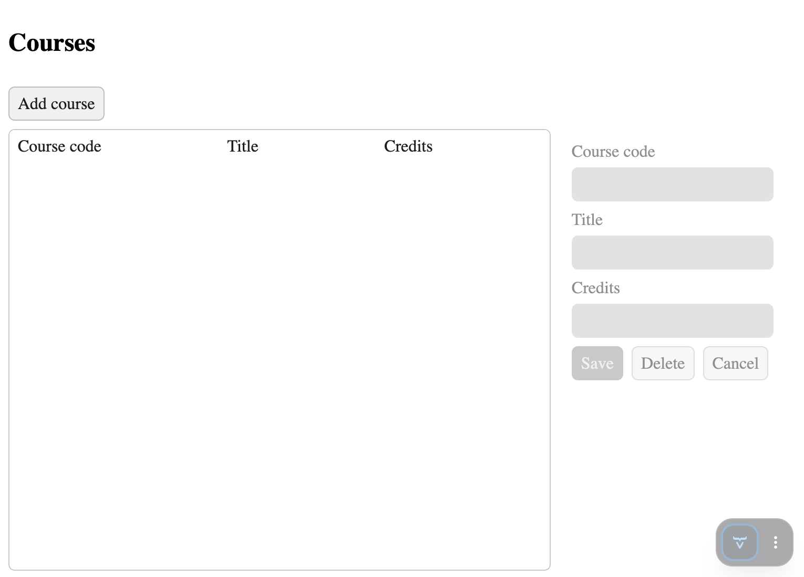

# Overview

Module 5 builds on the previous modules by adding a simple frontend UI to perform CRUD operations on the `courses` table we defined.

Sample of the CRUD screen that was built is below:



## Running the code

From within the module5 directory, run the following:

```shell
docker-compose up -d
../mvnw spring-boot:run
```

After everything is started you can navigate to:

* [CRUD UI Screen](https://localhost:8443)
* [Swagger UI](https://localhost:8443/swagger-ui/index.html)