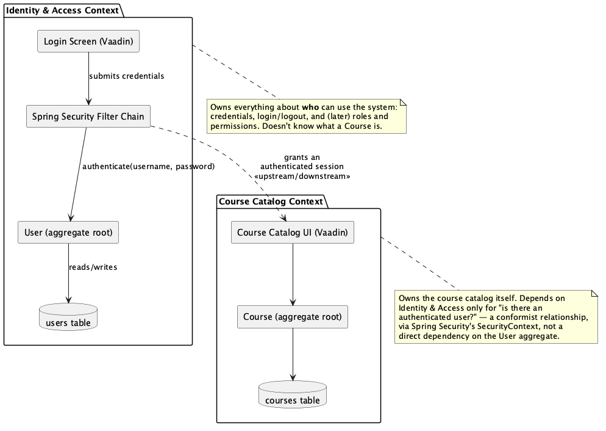
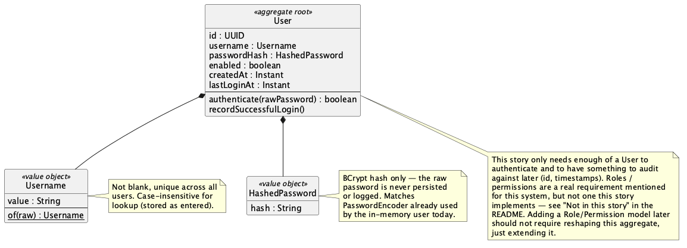
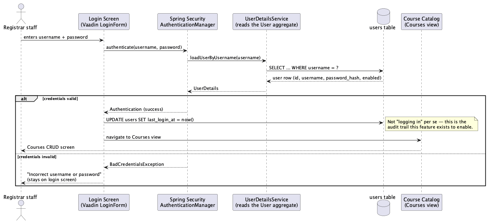
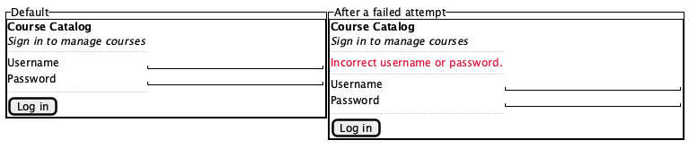

# Overview

Module 6 grows the course catalog from a single-tenant classroom demo into something with real
users. Feature 1 puts a login screen in front of [Module 5](../module5/README.md)'s Courses CRUD
screen, backed by [Spring Security](https://spring.io/projects/spring-security) with credentials
stored in a Postgres `users` table — replacing the one shared, hardcoded credential (`student` /
`changeit`) every earlier module has used.

## Running the code

From within the `module6_feature1` directory:

```shell
docker-compose up -d
../mvnw spring-boot:run
```

Then open <https://localhost:8443>. `DefaultUserSeeder` creates a `student` / `changeit` user in
the `users` table on first startup, so those same credentials from Module 3 on still work — this
time checked against a real database row instead of an in-memory user. The REST API and Swagger UI
(<https://localhost:8443/swagger-ui/index.html>) require the same credentials.

## Why a `users` table instead of another hardcoded credential

Every earlier module authenticated with one shared, in-memory credential
(`app.security.username` / `app.security.password` in `application.properties`). That's fine when
there's one person to authenticate. It stops working the moment there's more than one: nobody can
tell *which* person created or deleted a course, and there's no way to ever let one person do more
than another. A `users` table is what makes both of those answerable — an audit trail (this story)
and permissions (a later story) both need a real, individual identity to hang off of.

## Agile

### Epic

**User Authentication & Accountability for the Course Catalog** — replace the single shared
credential with real user accounts, so that every action taken in the system can be tied to the
person who took it, and different people can eventually be granted different levels of access.

### Story: Login screen backed by per-user credentials

> As a registrar staff member,
> I want to sign in with my own username and password before I can see or change the course
> catalog,
> so that access to the system is tied to me individually, not a credential everyone shares.

**Acceptance criteria**

1. Given I open the app without a session, when the app loads, then I see a login screen instead
   of the Courses view.
2. Given I enter a username and password that match a row in the `users` table, when I submit the
   form, then I'm taken to the Courses CRUD view.
3. Given I enter a username/password that doesn't match, when I submit, then I stay on the login
   screen and see "Incorrect username or password" (see [wireframe](#wireframe) below).
4. Given I'm signed in, when I navigate around the app within the session lifetime, then I stay
   signed in (normal Vaadin/Spring session behavior — no re-prompting per view).
5. Given I successfully sign in, when sign-in completes, then my `users` row's `last_login_at` is
   updated — the audit hook this story exists to build.
6. Given the REST API (`/api/courses/**`), when a request is made, then it requires HTTP Basic
   auth checked against the same `users` table, not the old in-memory user — the UI and the API
   share one source of truth for credentials.

**Not in this story.** The `users` table is deliberately designed so these can be added later
without reshaping it (see the [domain model](#domain-model-the-user-aggregate) below), but none of
them are built here:

- Roles/permissions enforcement (who can edit vs. only view)
- Self-service registration ("create account") screen
- Password reset / "forgot password"
- Account lockout after repeated failed attempts
- "Remember me" / persistent login across browser sessions
- Any identity provider other than a username + password stored in our own database (no OAuth/SSO)

**Definition of done**

- `ApiSecurityConfig` and `WebSecurityConfig` require authentication for both `/api/courses/**`
  and the Vaadin UI, backed by a `UserDetailsService` that reads from the `users` table —
  `InMemoryUserDetailsManager` is retired.
- At least one seeded user exists so the app is usable right after `docker compose up -d`.
- Passwords are stored using the existing `BCryptPasswordEncoder`, never in plain text.
- The acceptance criteria above are each covered by a Cucumber scenario (see
  [Acceptance tests](#acceptance-tests) below), and `CourseControllerTest` still passes unchanged
  in spirit against the new `users`-table-backed auth.

## Domain-Driven Design

### Ubiquitous language

| Term | Meaning |
| --- | --- |
| **User** | A person authorized to access the system (registrar staff, for now). The aggregate root of the Identity & Access context. |
| **Username** | A unique, human-chosen identifier for a User; used to look up credentials at login. |
| **Credentials** | The username + password pair supplied at login. |
| **Authentication** | Verifying that supplied credentials match a known User. What this story implements. |
| **Authorization** | Deciding what an *authenticated* User is allowed to do. Not implemented in this story — everyone who can sign in has the same access, same as today. |
| **Session** | The server-side state that remembers a User is authenticated between requests; what lets the Vaadin UI hold view state without re-authenticating on every click. |
| **Audit trail** | The record of who did what and when. This story lays the groundwork by giving every request a real User instead of one shared credential. |
| **Role / Permission** | A named grant of capability assignable to a User. Explicitly out of scope for this story, but the reason `User` is modeled as its own aggregate now instead of just swapping the one hardcoded credential for a single row. |

### Bounded context map

Identity & Access is modeled as its own bounded context, separate from the Course Catalog context
Module 2–5 already built. Identity & Access owns *who* can use the system; Course Catalog owns
*course data*. Course Catalog depends on Identity & Access only through Spring Security's
`SecurityContext` (is there an authenticated user?) — not on the `User` aggregate directly. That
keeps "add roles to `User`" from ever becoming a change to `Course`.



[`ddd/bounded-context.puml`](./ddd/bounded-context.puml)

### Domain model: the `User` aggregate

`User` is the aggregate root for the Identity & Access context. `Username` and `HashedPassword`
are value objects rather than plain strings so the rules that make them valid (not blank, unique;
always a hash, never plaintext) live in one place. The model intentionally carries only what this
story needs — enough to authenticate and to audit against (`id`, `createdAt`, `lastLoginAt`) —
without roles or permissions, which is a separate story built as a later addition, not a rework.



[`ddd/domain-model.puml`](./ddd/domain-model.puml)

The implementation simplifies this one step further: `User` (in `model/User.java`) stores
`username`/`passwordHash` as plain `String`s rather than dedicated `Username`/`HashedPassword`
classes. Their invariants still hold — `@NotBlank` plus a unique column for the former, always
constructed via `PasswordEncoder.encode(...)` for the latter — just enforced inline rather than
through wrapper types, since this aggregate is small enough that the extra classes wouldn't earn
their keep yet.

### Login flow

How a login attempt crosses the layers, from the Vaadin login form down to the `users` table and
back — including where the audit write (`last_login_at`) happens, and how a failed attempt reports
back without ever reaching the Courses view.



[`ddd/login-sequence.puml`](./ddd/login-sequence.puml)

## Wireframe

The login screen, in its default state and after a failed attempt. Built with Vaadin's own
`LoginForm`/`LoginOverlay` component, which already provides the error-banner behavior shown on
the right — this wireframe is a guide for copy and layout, not a custom component to build from
scratch.



[`wireframe/login-screen.puml`](./wireframe/login-screen.puml)

## Acceptance tests

Each acceptance criterion above has a matching Cucumber scenario in
[`src/test/resources/features/login.feature`](../../module6_feature1/src/test/resources/features/login.feature),
run via `RunCucumberTest` alongside the rest of the module's tests (`../mvnw test`). The
scenarios drive the real, running app — real Spring Security filter chains, a real Testcontainers
Postgres `users` table — over plain HTTPS requests rather than through a browser: they GET
`/login` to read the CSRF token Vaadin embeds in the page, POST credentials the same way the
rendered `LoginForm` would, and assert on the resulting redirects, session cookies, and `users`
rows. The one thing this doesn't verify is the literal rendered "Incorrect username or password"
text — that's Vaadin's own `LoginForm` component doing what it already does (see the wireframe
above), not custom code this project owns; the scenario for AC 3 instead asserts on the
`/login?error` redirect that triggers it.

**A scope note on AC 5.** `LoginAuditListener` updates `last_login_at` on every successful
authentication, and the REST API re-authenticates on every request (HTTP Basic is stateless) —
so in practice this column updates on every authenticated API call, not only on interactive
sign-in. "Most recently verified" rather than strictly "most recently signed in"; splitting the
two is future work, not something this story needed.

**A bug fixed after the fact.** [Feature 2](../module6_feature2/README.md#acceptance-tests)'s
fuller end-to-end test run (both filter chains active, not just one at a time) turned up a real
defect here too: an unauthenticated `/api/courses` request returned a `302` redirect to `/login`
instead of a `401`, because `BasicAuthenticationEntryPoint`'s `response.sendError(401)` triggers an
internal forward to Spring Boot's `/error` endpoint, which then had to pass `WebSecurityConfig`'s
own "any request must be authenticated" rule and got redirected before the original 401 ever
reached the client. Fixed by permitting `/error` in `WebSecurityConfig`, here as well as in
Feature 2 — a bug fix, not a feature change, so it's applied retroactively rather than left as
"how it was originally covered in class."
