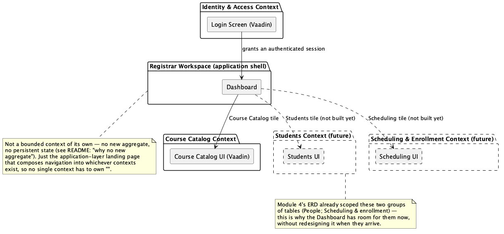
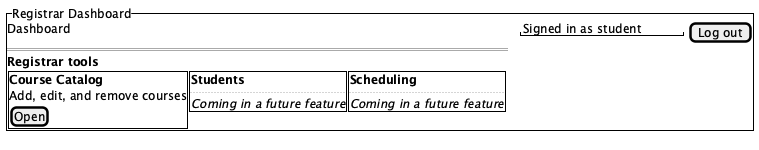

# Overview

Module 6 Feature 2 builds on [Feature 1](../module6_feature1/README.md)'s login screen. Signing
in no longer drops a registrar staff member straight into the Courses CRUD screen — it lands them
on a small Dashboard, with a tile that opens the Course Catalog. The Courses screen itself is
unchanged; it just isn't the front door anymore.

## Running the code

From within the `module6_feature2` directory:

```shell
docker-compose up -d
../mvnw spring-boot:run
```

Then open <https://localhost:8443> and sign in with `student` / `changeit` (seeded the same way as
Feature 1). You'll land on the Dashboard; its "Course Catalog" tile opens the Courses screen at
`/courses`, which now has a "← Dashboard" link back.

## Why this is a Dashboard, not just a moved route

Module 4's schema design already scoped this system into three groups of tables: the academic
catalog (courses — built in Feature 1), people (students, faculty/staff), and scheduling &
enrollment. Every one of those becomes its own screen eventually. If Courses stays at the root
route, the *next* screen has nowhere obvious to put itself without either fighting Courses for
`""` or bolting navigation onto a view that was never designed to be a hub. A Dashboard makes the
landing page belong to *navigation*, not to whichever tool got built first — Course Catalog is
today's only tile, not a permanent tenant of `""`.

## Agile

### Epic

**Registrar Workspace** — give registrar staff a home base to launch into the system's various
tools (Course Catalog today; Students, Scheduling, and others as they're built), rather than
hardcoding a single landing view that has to be reshuffled every time a new tool is added.

### Story: Land on a dashboard after signing in

> As a registrar staff member,
> I want to land on a dashboard after I sign in, with a way to get to the Course Catalog,
> so that I have one home to work from as more tools are added to this system, instead of being
> dropped into one hardcoded screen.

**Acceptance criteria**

1. Given I sign in successfully, when sign-in completes, then I land on the Dashboard, not the
   Courses view directly.
2. Given I'm on the Dashboard, when I look at it, then I see a way to open the Course Catalog (a
   tile with an "Open" link — see [wireframe](#wireframe) below).
3. Given I'm on the Dashboard, when I choose "Course Catalog", then I'm taken to the Courses CRUD
   screen at its own route.
4. Given I'm on the Courses CRUD screen, when I want to return, then there's a way back to the
   Dashboard.
5. Given I'm not signed in, when I request the Dashboard (or the Courses screen) directly, then
   I'm redirected to the login screen — same protection as every other view, on both routes now.
6. Given the Dashboard today, when I look at what's on it, then only the Course Catalog tile is
   open — Students and Scheduling appear as future placeholders, not built now.

**Not in this story**:

- The Students or Scheduling screens themselves — only the Dashboard shell and the one existing
  Course Catalog tile
- Role-based visibility of dashboard tiles (everyone sees the same tiles — permissions are still
  out of scope, per [Feature 1](../module6_feature1/README.md))
- Dashboard "widgets" or summary data (counts, charts, recent activity) — this dashboard is a
  navigation launcher only, deliberately minimal

**Definition of done**

- `DashboardView` is the `@Route("")` (the post-login landing route); `CourseView` moves to
  `@Route("courses")`, protected the same way (`@PermitAll`)
- The Dashboard shows a working "Course Catalog" tile; the Courses screen has a link back to the
  Dashboard
- Covered by a new Cucumber feature (`dashboard.feature`) alongside `login.feature`, updated where
  it assumed sign-in landed on Courses directly

## Domain-Driven Design

### Ubiquitous language additions

| Term | Meaning |
| --- | --- |
| **Dashboard** | The post-login landing page; a launcher into whichever registrar tools exist, not a tool itself. |
| **Tile** | A single navigable entry on the Dashboard (e.g. "Course Catalog") pointing at one tool's screen. |
| **Registrar Workspace** | The umbrella the Dashboard represents — today just Course Catalog; Module 4's People and Scheduling & enrollment table groups are its future tenants. |

### Why no new aggregate

Every other feature so far added a domain concept with real, persistent state: `Course`, then
`User`. This one doesn't. The Dashboard has no table, no entity, no invariant to protect — it's an
application-layer composition of navigation links, not a piece of the domain. Forcing a "Dashboard"
aggregate into existence for this story would be modeling a UI concern as if it were business data.
The right DDD call here is the same kind of judgment call as [Feature 1](../module6_feature1/README.md#domain-model-the-user-aggregate)'s
"not everything needs a value object" — recognizing when a feature is presentation/navigation, not
domain, and not manufacturing ceremony to match a template.

### Bounded context map

The Dashboard doesn't own a bounded context of its own; it's a thin, application-layer landing page
that composes navigation into whichever contexts exist — Course Catalog today, Students and
Scheduling & Enrollment (the other two groups from [Module 4](../module4/README.md)'s schema) once
they're built. Identity & Access (Feature 1) is unchanged — it still just answers "is there an
authenticated session?" for whatever the Dashboard sends someone into.



[`ddd/bounded-context.puml`](./ddd/bounded-context.puml)

## Wireframe

The Dashboard: a header matching the Courses screen's (signed-in-as, log out), and one tile per
registrar tool — "Course Catalog" open and working, "Students" and "Scheduling" shown as future
placeholders so the layout doesn't need to change shape when they arrive.



[`wireframe/dashboard.puml`](./wireframe/dashboard.puml)

## Acceptance tests

`src/test/resources/features/dashboard.feature` covers this story's criteria the same HTTP-level
way [Feature 1's login.feature](../module6_feature1/README.md#acceptance-tests) does — no browser,
real Spring Security filter chains, real Testcontainers Postgres. A plain HTTP client can't see
*which* Vaadin view renders at a route, so "lands on the Dashboard" is verified the one way that's
actually observable: the post-login redirect goes to `/` (Vaadin's default success URL), and
`/courses` — `CourseView`'s own route now — exists as its own, separately-protected route rather
than living at `/` the way it did in Feature 1.

`login.feature` carried forward from Feature 1 with one adjustment: its steps no longer assert
*which* view lands at `/`, since that's this feature's concern, not login's — see the comment at
the top of that file.

**A bug this testing found.** Running the full suite (both the WebMvcTest slice and the
end-to-end Cucumber scenarios) turned up a real defect, not a test artifact: an unauthenticated
`/api/courses` request was returning a `302` redirect to `/login` instead of a `401`. The cause —
`BasicAuthenticationEntryPoint` calling `response.sendError(401)`, which the servlet container
turns into an internal forward to Spring Boot's `/error` endpoint, which then had to pass
`WebSecurityConfig`'s own "any request must be authenticated" rule and got redirected before the
original 401 ever reached the client. Fixed by permitting `/error` in `WebSecurityConfig` (in both
Feature 1 and Feature 2 — the same class exists in each). This is exactly the kind of bug a
`@WebMvcTest` slice can't catch, since it only ever loads one filter chain at a time; it took a
real end-to-end run with both chains active to surface it.

## Viewing/editing the diagrams

Same tooling as Feature 1: the
[PlantUML VS Code extension](https://marketplace.visualstudio.com/items?itemName=jebbs.plantuml),
the `plantuml` CLI (`brew install plantuml`), or the
[online PlantUML editor](https://www.plantuml.com/plantuml/uml/).
